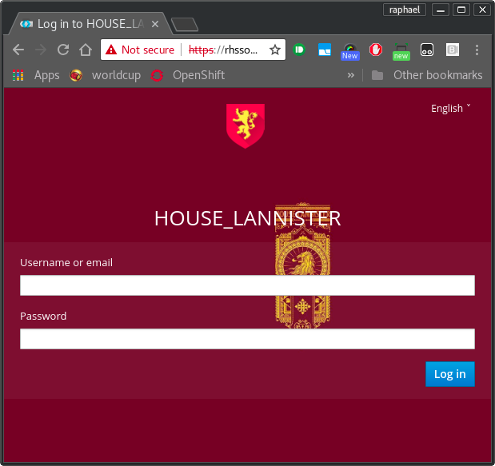
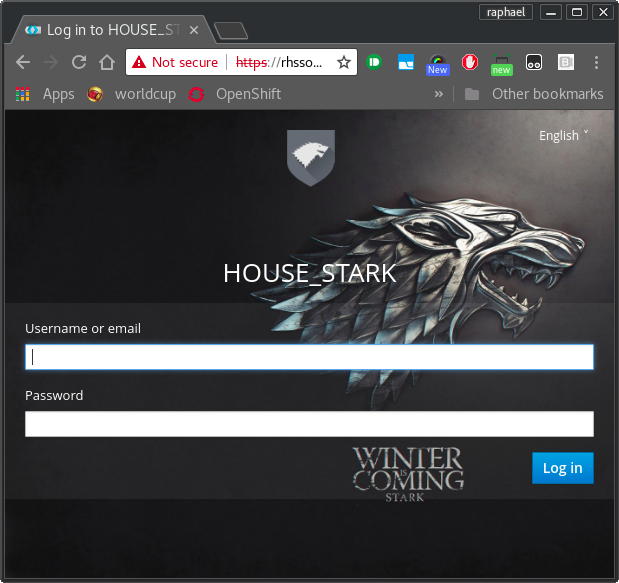

keycloak.got
==============

><i class="icon-file"></i>**GOALS:**
> - Provide a collection of apps that can be used to test keycloak across realms and clients;
> - Provide a collection of customized realm themes based on game of thrones;
> - Can be used to demonstrate keycloak features and single sign-on for users.

```
#keycloak #redhat #example
```

```
v1.0
```

### SCREENSHOTS

Castle Black app:


Winterfell app:


Kings Landing app:


HOUSE LANNISTER realm login:



HOUSE STARK realm login:



### INSTALLATION

1. Install EAP 6.4 or 7.1 with keycloak-adapter on you local machine; 
2. Get your Red Hat Single Sign-On (Keycloak) running on port 8080/8443;
3. Import REALM settings using <b>lannister-realm-export.json</b> and <b>stark-realm-export.json</b> files attached in this project;
3. Run all 3 applications using your IDE ou install maven wildfly-plugin;
4. Done.

#### RELEASE NOTES

#### 1.0.0
 - Initial Release