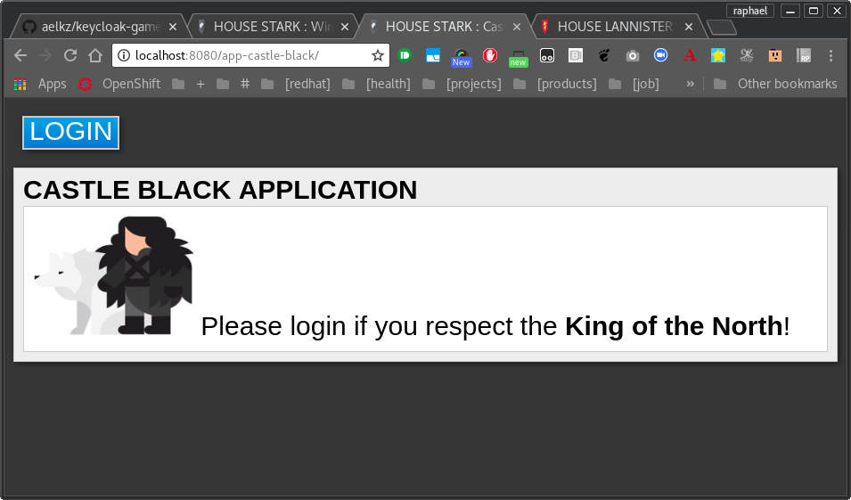
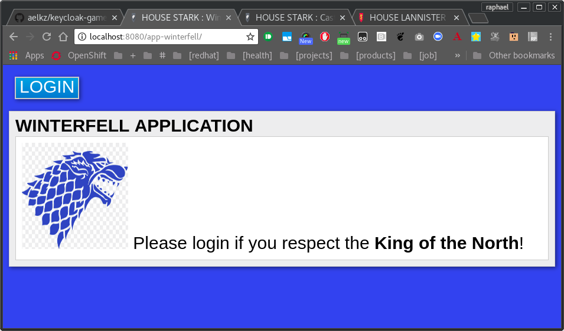
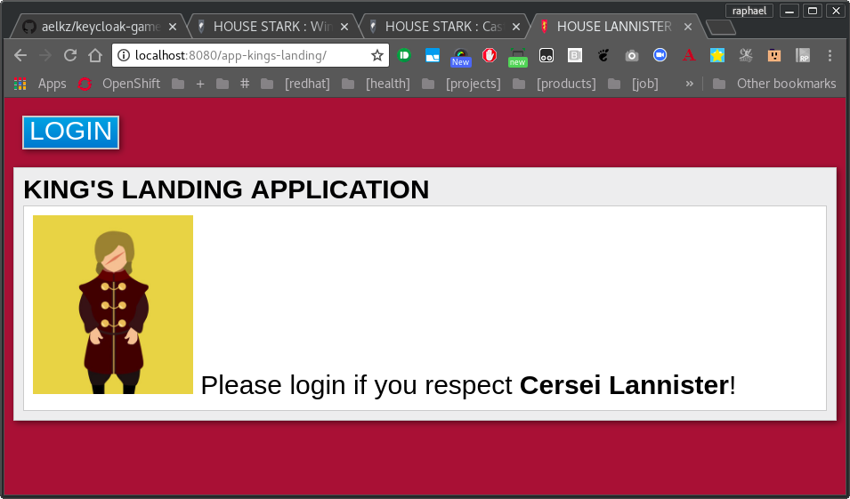

keycloak.got
==============

><i class="icon-file"></i>**GOALS:**
> - Provide a collection of apps that can be used to test keycloak across realms and clients;
> - Provide a collection of customized realm themes based on game of thrones;
> - Can be used to demonstrate keycloak features and single sign-on for users.

```
#keycloak #redhat #example
```

```
v1.0
```

### SCREENSHOTS

Castle Black app:



Winterfell app:



Kings Landing app:



### INSTALLATION

```
$ mvn clean package
```

#### RELEASE NOTES


#### 1.0.0
 - Initial Release